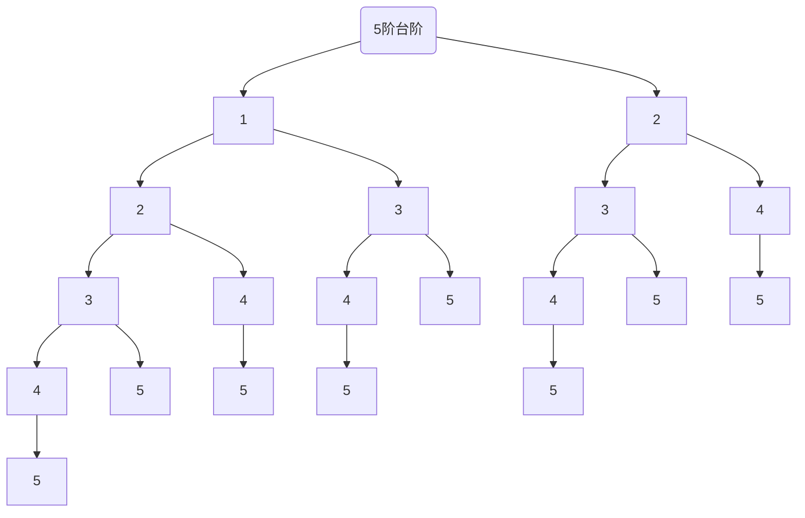
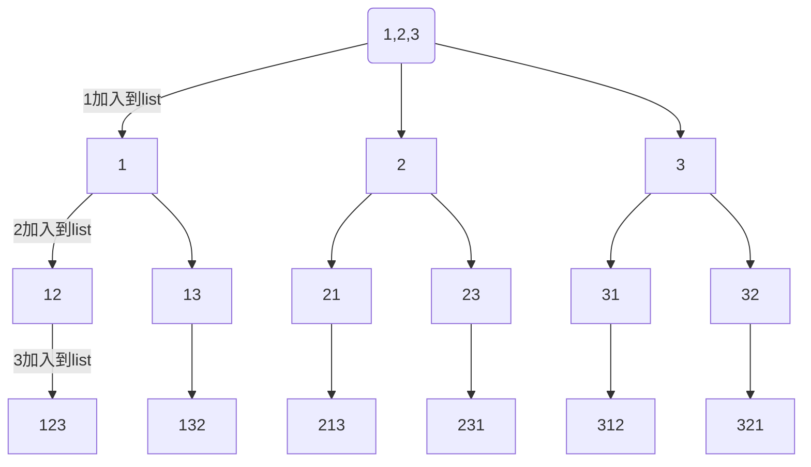
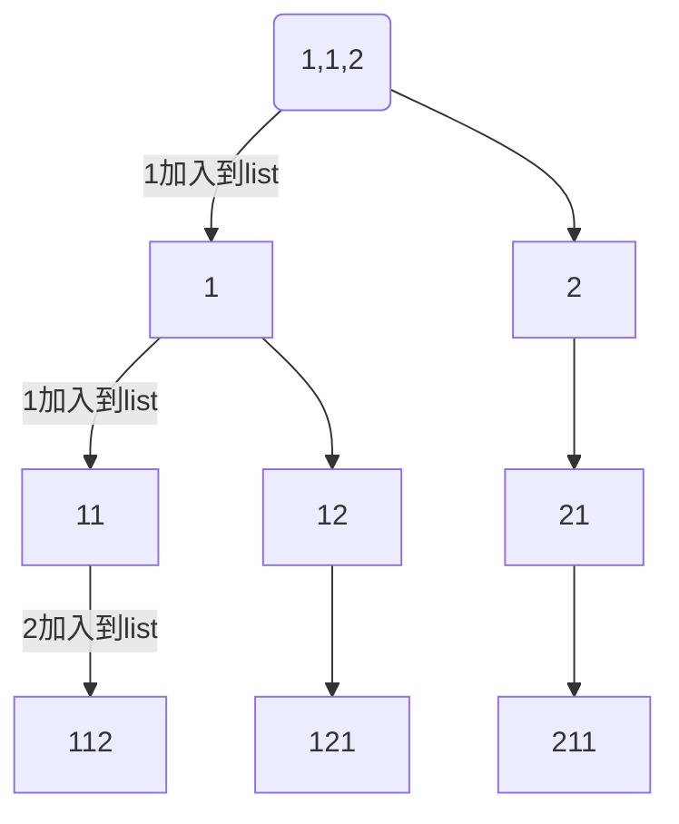

---
{"dg-publish":true,"permalink":"/数据结构/递归/"}
---

## 定义
程序调用自身编程技巧

一般来说，递归需要有边界条件、递归前进段和递归返回段。当边界条件不满足时，递归前进；当边界条件满足时，递归返回。

## 递归的应用条件

==构成递归需要具备==如下条件：
1. 子问题必须与原始问题为同样的事，且更为简单。
2. 父问题的结果依赖于子问题的
3. 问题解法按递归算法实现。
4. 数据结构的形式是按照递归定义的。如二叉树等，由于结构本身就有递归的特性，因此树也经常被用于递归形象化的模型。

## 递归的缺点
递归解决问题运行效率较低，因此应该尽量避免使用，除非没有更好的算法或者某种特定情况，递归更为合适的时候选择递归解决问题。在递归调用的过程中系统为每一层的返回点，局部变量等开辟了栈来储存，递归次数过多可能造成栈溢出。

## 递归思想的内涵

递归实际上是有去（递）有回（归）的。
“有去”是指：递归问题必须可以分解为若干个规模较小，与原问题形式相同的子问题，这些子问题可以用相同的解题思路来解决；“有回”是指 : 这些问题的演化过程是一个从大到小，由近及远的过程，并且会有一个明确的终点(临界点)，一旦到达了这个临界点，就不用再往更小、更远的地方走下去。最后，从这个临界点开始，原路返回到原点，原问题解决。

更直接地说，递归的基本思想就是把规模大的问题转化为规模小的相似的子问题来解决。特别地，在函数实现时，因为解决大问题的方法和解决小问题的方法往往是同一个方法，所以就产生了函数调用它自身的情况，这也正是递归的定义所在。格外重要的是，这个解决问题的函数必须有明确的结束条件，否则就会导致无限递归的情况。

## 用数学归纳法来理解递归

递归的数学模型其实就是==数学归纳法==，这个在高中的数列里面是最常用的了，回忆一下数学归纳法。
数学归纳法适用于将解决的原问题转化为解决他的子问题，而它的子问题又变成子问题的子问题，而且我们发现这些问题其实都是一个模型，也就是说存在相同的逻辑归纳处理项。当然有一个是例外的，也就是归纳结束的那个处理方法不适用我们的归纳处理项，不然就无穷归纳了。总的来说，归纳法主要包含以下三个关键要素：
- 步进表达式：问题蜕变成子问题的表达式
- 结束条件：什么时候可以不再使用步进表达式
- 直接求解表达式：在结束条件下能够直接计算返回值的表达式
事实上，这也正是某些数列问题在利用编程的方式去解决时可以使用递归的原因。例如斐波那契数列问题。

## 递归的三要素

- 明确递归终止条件
- 给出递归终止时的处理办法
- 提取重复逻辑，缩小问题规模

遍历链表的递推关系为

$$  
f(n) = \begin{cases} 停止& n = null \\ f(n.next) & n \neq null \end{cases}  
$$
  

- 深入到最里层叫做**递**
    
- 从最里层出来叫做**归**
    
- 在**递**的过程中，外层函数内的局部变量（以及方法参数）并未消失，**归**的时候还可以用到

## 递归模型
模型一：
```js
function recursion(){
	if(end_condition) //递归终止条件
		end;  //递归终止时处理方法
	else {
		solve: //递
		recursion(小问题) //递归到最深处，归来
	}
}
```
模型二：
```js
function recursion(){
	if(end_condition) //递归终止条件
		end;  //递归终止时处理方法
	else {
		recursion(小问题) //递归到最深处，归来
		solve: //递
	}
}
```
## 递归的应用场景

递归算法一般用于解决三类问题：
1. 问题的定义是按递归定义的（斐波那契函数,阶乘,...)
2. 问题的解法时递归的(有些问题只能使用递归方法来解决，例如，汉诺塔问题，....)
3. 数据结构是递归的(链表、树等操作，包含树的遍历，树的深度,...)
## 递归与循环的区别

递归实现转换成非递归实现一般需要二步工作：
1. 自己建立“堆栈（一些局部变量）”来保存这些内容以便代替系统栈，比如树的三种递归遍历方式
2. 把对递归的调用转变为对循环处理


## 递归的应用

### 递推求阶乘

> [!NOTE] 递推求阶乘
> 

- 阶乘的定义 $n!= 1⋅2⋅3⋯(n-2)⋅(n-1)⋅n$，其中 $n$ 为自然数，当然 $0! = 1$
    
- 递推关系

$$ 
f(n) = 
\begin{cases}
1 & n = 1\\
n * f(n-1) & n > 1
\end{cases}
$$
```java
public class ReversePrintString {  
 
	public void r(String str, int n) {
		int len = str.length();
		if (len == n) {
			return;
		}
		r(str, n + 1);
		System.out.println(str.charAt(n));
	}
}
```


### 递归反向打印字符串

```java
public class ReversePrintString {

    public void r(String str, int n) {

        int len = str.length();
        if (len == n) {
            return;
        }
        r(str, n + 1);
        System.out.println(str.charAt(n));
    }
}

```

### 递归二分查找

```java
public int dfs(int[] array, int l, int r, int target) {
	int mid = (l + r) >> 1;
	if (l == r) {
		return l;
	}
	if (target <= array[mid]) {
		r = mid;
	} else if (array[mid] < target) {
		l = mid + 1;
	}
	return dfs(array, l, r, target);
}
```


### 递归冒泡排序


```java
public class BubbleSort {
    public static void main(String[] args) {
        BubbleSort bubbleSort = new BubbleSort();
        int[] arr = {5, 3, 4, 6, 8, 9, 1, 2, 3};
        bubbleSort.sort(arr, arr.length - 1);
        System.out.println(Arrays.toString(arr));
    }

    public void sort(int[] arr, int endIndex) {
        if (endIndex == 0) {
            return;
        }
        for (int i = 0; i < endIndex; i++) {
            if (arr[i] > arr[i + 1]) {
                int tmp = arr[i + 1];
                arr[i + 1] = arr[i];
                arr[i] = tmp;
            }
        }
        sort(arr, endIndex - 1);
    }
    //优化后
    public void sortNew(int[] arr, int endIndex) {
        if (endIndex == 0) {
            return;
        }
        int x = 0;
        for (int i = 0; i < endIndex; i++) {
            if (arr[i] > arr[i + 1]) {
                int tmp = arr[i + 1];
                arr[i + 1] = arr[i];
                arr[i] = tmp;
                x = i;
            }
        }
        sortNew(arr, x);
    }
}
```

### 递归插入排序

```java
public void insertionOptimized(int[] a, int low) {
	int length = a.length;
	if (low == length) {
		return;
	}
	int tmp = a[low];
	int i = low - 1;//以排序区域指针

	while (i >= 0 && a[i] > tmp) {//没有找到插入位置
		a[i + 1] = a[i];//空出插入位置
		i--;
	}
	//找到插入位置
	if (i + 1 != low) {//排除掉未进行交换
		a[i + 1] = tmp;
	}
	insertion(a, low + 1);
}
```


### 斐波那契数列系列问题

- 之前的例子是每个递归函数只包含一个自身的调用，这称之为 single recursion
    
- 如果每个递归函数例包含多个自身调用，称之为 multi recursion

**递推关系**

$$  
f(n) = \begin{cases} 0 & n=0 \\ 1 & n=1 \\ f(n-1) + f(n-2) & n>1 \end{cases}  
$$
```java
public class Fibonacci {
    public static void main(String[] args) {
        Fibonacci fibonacci = new Fibonacci();
        int r = fibonacci.f(8);
        System.out.println(r);
    }

    public int f(int n) {
        if (n == 0) {
            return 0;
        }
        if (n == 1) {
            return 1;
        }

        return f(n - 1) + f(n - 2);
    }
}
```


#### 改进记忆法
```java
public class Fibonacci {

    public static void main(String[] args) {
        Fibonacci fibonacci = new Fibonacci();
        int r = fibonacci.fibonacci(8);
        System.out.println(r);
    }

    public int fibonacci(int n) {
        int[] cache = new int[n + 1];
        Arrays.fill(cache, -1);//{-1.-1}
        cache[0] = 0;
        cache[1] = 1;
        return f(n, cache);
    }

    public int f(int n, int[] cache) {
        if (cache[n] != -1) {
            return cache[n];
        }

        int x = f(n - 1, cache);
        int y = f(n - 2, cache);
        cache[n] = x + y;
        return x + y;
    }
}
```


### 爬楼梯问题


> [!NOTE] 爬楼梯问题
> 一个楼梯总共有n阶台阶，问从第0阶台阶走到第n阶台阶一共有多少中方案。你每次可以走一个台阶或者俩个台阶

假设5阶台阶，第一步可以走一阶台阶或者两阶：




```java
public class Test {
  private static int n;
  private static int result = 0;
  public static void main(String[] args) {
    n = 5;
    int s = dfs(0);
    System.out.println("asdf：" + s);
  }

  private static int dfs(int u) {
    if (u == 5) {
      result++;
    }
    if (u < n) {
      dfs(u + 1);
      dfs(u + 2);
    }
    return result;
  }
}
```

### 全排列

> [!NOTE] 全排列
> 给定一个不含重复数字的数组nums，返回其所有可能的全排列，你可以按任意顺序返回答案

例如：
```
输入：nums=[1,2,3]
输出：[[123],[132],[213],[231],[312],[321]]
```





```java
public class Solution{
  List<List<Integer>> result = new ArrayList();//存储全排列结果
  boolean stat[];//判断当前数字有没有用过
  List<Integer> path = new ArrayList();//存每一个方案数组
private List<List<Integer>> permute(int[] nums) {

    int n = nums.length;
    stat = new boolean[n];
    dfs(0, nums);
    return null;
  }

  private void dfs(int u, int[] nums) {
  //如果所有数都用过，说明找到了一组方案
    if (u == nums.length) {
      result.add(new ArrayList<>(path));
      return;
    }
  //否则，就循环遍历数组
    for (int i = 0; i < nums.length; i++) {
      if (!stat[i]) {//判断当前数字是否用过
        path.add(nums[i]);
        stat[i] = true;//加入到方案数组后，标记当前数字被用过
        dfs(u + 1, nums);
        // 回溯
        stat[i] = false;
        path.remove(path.size() - 1);
      }
    } 
  }
}
```

### 有重复数字的全排列


> [!NOTE] 有重复数字的全排列
> 给定一个含重复数字的数组nums，返回其所有可能的全排列，你可以按任意顺序返回答案

例如：
```
输入：nums=[1,1,2]
输出：[[112],[121],[211]]
```




```java
public class Solution{
  List<List<Integer>> result = new ArrayList();//存储全排列结果
  boolean stat[];//判断当前数字有没有用过
  List<Integer> path = new ArrayList();//存每一个方案数组
private List<List<Integer>> permute(int[] nums) {

    int n = nums.length;
    stat = new boolean[n];
    dfs(0, nums);
    return null;
  }

  private void dfs(int u, int[] nums) {
  //如果所有数都用过，说明找到了一组方案
    if (u == nums.length) {
      result.add(new ArrayList<>(path));
      return;
    }
  //否则，就循环遍历数组
    for (int i = 0; i < nums.length; i++) {
      if (!stat[i]) {//判断当前数字是否用过
	    if (i > 0 && nums[i] == nums[i - 1] && !stat[i - 1]) {
		  continue;
	    }
        path.add(nums[i]);
        stat[i] = true;//加入到方案数组后，标记当前数字被用过
        dfs(u + 1, nums);
        // 回溯
        stat[i] = false;
        path.remove(path.size() - 1);
      }
    } 
  }
}
```


### 多递归

#### 汉诺塔
Tower of Hanoi，是一个源于印度古老传说：大梵天创建世界时做了三根金刚石柱，在一根柱子从下往上按大小顺序摞着 64 片黄金圆盘，大梵天命令婆罗门把圆盘重新摆放在另一根柱子上，并且规定

- 一次只能移动一个圆盘
- 小圆盘上不能放大圆盘

下面的动图演示了4片圆盘的移动方法 


##### 思路
- 假设每根柱子标号 a，b，c，每个圆盘用 1，2，3 ... 表示其大小，圆盘初始在 a，要移动到的目标是 c
- 如果只有一个圆盘，此时是最小问题，可以直接求解
	- 移动圆盘1 $a \mapsto c$
- 

| a | b | c |
| ---- | ---- | ---- |
| 1 |  |  |
| 2 |  |  |
| 3 |  |  |


#### 杨辉三角


**分析**

把它斜着看

```
        1  
      1   1  
    1   2   1  
  1   3   3   1  
1   4   6   4   1
```

- 行 $i$，列 $j$，那么 $[i][j]$ 的取值应为 $[i-1][j-1] + [i-1](j)$
    
- 当 $j=0$ 或 $i=j$ 时，$[i][j]$ 取值为 $1$

```java
public class PascalTriangle {

    public static void main(String[] args) {
        PascalTriangle pascalTriangle = new PascalTriangle();
        pascalTriangle.toPrint(15);
    }

    private void printSpace(int n, int i) {
        int num = (n - i - 1) * 2;
        for (int j = 0; j <= num; j++) {
            System.out.print(" ");
        }
    }

    private void toPrint(int n) {
        for (int i = 0; i < n; i++) {
            printSpace(n, i);
            for (int j = 0; j <= i; j++) {
                System.out.printf("%-4d", element(i, j));
            }
            System.out.println();
        }
    }

    public int element(int i, int j) {
        if (j == 0 || i == j) {
            return 1;
        }
        int left = element(i - 1, j - 1);
        int right = element(i - 1, j);
        return left + right;
    }

}
```

##### 记忆法改进
时间复杂度是指数级的，使用缓存优化
二维数组

```java
private void toPrint(int n) {
        int[][] cache = new int[n][];
        for (int i = 0; i < n; i++) {
            printSpace(n, i);
            cache[i] = new int[i + 1];
            for (int j = 0; j <= i; j++) {
                System.out.printf("%-4d ", element(i, j, cache));
            }
            System.out.println();
        }
    }

    public int element(int i, int j, int[][] cache) {
        if (cache[i][j] > 0) {
            return cache[i][j];
        }

        if (j == 0 || i == j) {
            cache[i][j] = 1;
            return 1;
        }
        int left = element(i - 1, j - 1);
        int right = element(i - 1, j);
        cache[i][j] = left + right;
        return left + right;
    }
```

一位数组
```java
public static void print2(int n) {
    int[] row = new int[n];
    for (int i = 0; i < n; i++) {
        // 打印空格
        createRow(row, i);
        for (int j = 0; j <= i; j++) {
            System.out.printf("%-4d", row[j]);
        }
        System.out.println();
    }
}

private static void createRow(int[] row, int i) {
    if (i == 0) {
        row[0] = 1;
        return;
    }
    for (int j = i; j > 0; j--) {
        row[j] = row[j - 1] + row[j];
    }
}
```

注意：还可以通过每一行的前一项计算出下一项，不必借助上一行，这与杨辉三角的另一个特性有关，暂不展开了


## 递归的爆栈问题

用递归做 $n + (n-1) + (n-2) ... + 1$

```java
public static long sum(long n) {  
    if (n == 1) {  
        return 1;  
    }  
    return n + sum(n - 1);  
}
```

在我的机器上 $n = 12000$ 时，爆栈了

```java
Exception in thread "main" java.lang.StackOverflowError  
    at Test.sum(Test.java:10)  
    at Test.sum(Test.java:10)  
    at Test.sum(Test.java:10)  
    at Test.sum(Test.java:10)  
    at Test.sum(Test.java:10)  
    ...
```

为什么呢？

- 每次方法调用是需要消耗一定的栈内存的，这些内存用来存储方法参数、方法内局部变量、返回地址等等
    
- 方法调用占用的内存需要等到**方法结束时**才会释放
    
- 而递归调用我们之前讲过，不到最深不会回头，最内层方法没完成之前，外层方法都结束不了
    
    - 例如，$sum(3)$ 这个方法内有个需要执行 $3 + sum(2)$，$sum(2)$ 没返回前，加号前面的 $3$ 不能释放


## 递归时间复杂度-Master theorem[^14]

若有递归式

$$ 

T(n) = aT(\frac{n}{b}) + f(n)

$$

其中

- $T(n)$ 是问题的运行时间，$n$ 是数据规模
    
- $a$ 是子问题个数
    
- $T(\frac{n}{b})$ 是子问题运行时间，每个子问题被拆成原问题数据规模的 $\frac{n}{b}$
    
- $f(n)$ 是除递归外执行的计算

令 $x = \log_{b}{a}$，即 $x = \log_{子问题缩小倍数}{子问题个数}$

那么

$$  
T(n) = \begin{cases} \Theta(n^x) & f(n) = O(n^c) 并且 c \lt x\\ \Theta(n^x\log{n}) & f(n) = \Theta(n^x)\\ \Theta(n^c) & f(n) = \Omega(n^c) 并且 c \gt x \end{cases}  
$$

  

**例1**


## 递归时间复杂度-展开求解

